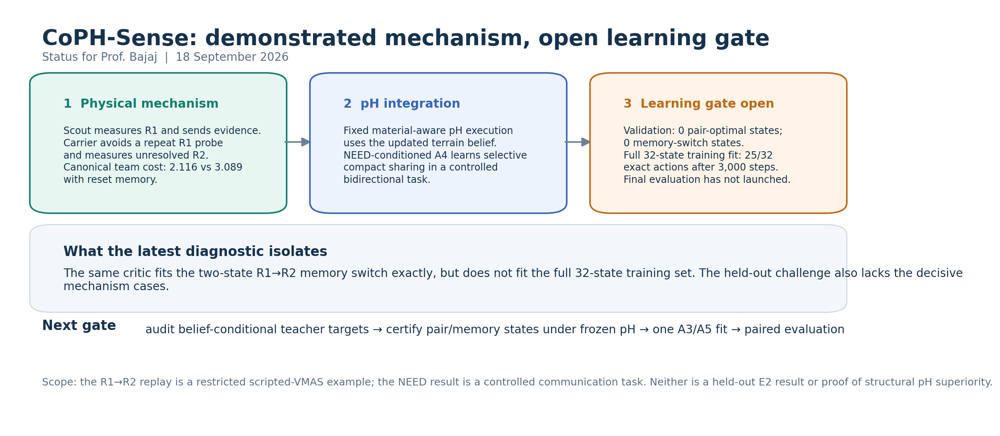

Prof. Bajaj,

We have demonstrated the cooperative look-ahead mechanism in a restricted moving-VMAS example: the scout probes Region 1 and shares evidence; the carrier uses that evidence to avoid repeating the probe and instead explores Region 2. In the canonical paired replay, team cost is **2.116 versus 3.089** when received memory is reset. The short [replay GIF](../../coph_fork/results/a5_moving_bridge/physical_search/frozen_two_fork_information.gif) shows the sequence.

The calibrated material-aware port-Hamiltonian executor is integrated, and a compact, NEED-conditioned communication policy works in a separate controlled bidirectional task. These establish the causal components, but **the final held-out unknown-terrain result has not been run**. In the latest A3/A5 gate, validation contained no pair-optimal or memory-switch cases. The shared critic fitted the two-state memory switch exactly, but only **25/32** decisions in the complete training audit after 3,000 steps. We stopped before confirmatory evaluation.

Next, we will audit the belief-conditional acquisition labels and action ranking, certify pair and memory cases under the frozen pH executor, and make one controlled A3/A5 fit before launching paired evaluation. The scientific target remains your proposed chain: **selective sensing and sharing → persistent team belief → changed Hamiltonian and motion**.

*The replay is a restricted scripted-VMAS demonstration; neither it nor the controlled NEED task is a held-out E2 result.*
